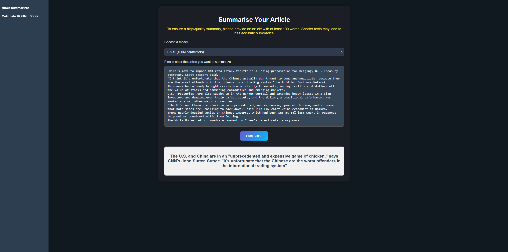

# Reducing News Reading Time with Transformer-Based Summaries
## Technologies Used

- Python: `numpy`, `pandas`, `matplotlib`, `seaborn`, 
- NLP preprocessing: `nltk`, `spacy`, `re`
- Neural Networks: `PyTorch` (LSTM, Attention Mechanism)
- Transformers: `transformers`, `pipeline`, `AutoTokenizer`, `evaluate`
- Back-end: `FastAPI`, `uvicorn`  
- Front-end: `HTML`, `CSS`, `JavaScript` 
- Containerization: `Docker`

## Demo 


#### Using Docker Image
A Docker image is available on **DockerHub**. You can pull and run the container on your machine using the following commands:
```
docker pull b3nett/news_summarizer_app:latest
docker run -p 80:80 b3nett/news_summarizer_app:latest
```
The container may take up to 2 minutes to start due to downloading and caching Hugging Face models and metrics. 
Then, open `http://localhost:80` in your browser. 

#### Using FastAPI
If you prefer not to use Docker, you can clone the repository and run the API with **Uvicorn**:
```
git clone https://github.com/andrii-zapukhlyi/crypto_market_sentiment.git
cd crypto_market_sentiment/app
pip install --no-cache-dir -r requirements.txt
uvicorn api:app --host 0.0.0.0 --port 80
```
Then, open `http://localhost:80` in your browser. 

## Objective
In today’s fast-paced world, a constant stream of news makes it difficult for people to stay informed—especially about political events—without spending a lot of time reading full articles. The goal is to help users quickly grasp key information without sacrificing understanding.

## Solution
To address this issue, I will develop an automatic news summarization system that generates concise and informative summaries using Deep Learning models. This project focuses on comparing standard neural networks, including those with Attention Mechanisms, to state-of-the-art Transformer models. Additionally, it aims to train a smaller model for experimental purposes, exploring the performance differences in NLP tasks.

## Achievements  
The T5-Small model generated the following summary for the article:
```
China's move to impose 84% retaliatory tariffs is a losing proposition for Beijing, U.S. Treasury Secretary Scott Bessent said.
"I think it's unfortunate that the Chinese actually don't want to come and negotiate, because they are the worst offenders in the international trading system," he told Fox Business Network.
This week had already brought crisis-era volatility to markets, wiping trillions of dollars off the value of stocks and hammering commodities and emerging markets.
U.S. Treasuries were also caught up in the market turmoil and extended heavy losses in a sign investors are dumping even their safest assets, and the dollar, a traditional safe haven, was weaker against other major currencies.
"The U.S. and China are stuck in an unprecedented, and expensive, game of chicken, and it seems that both sides are unwilling to back down," said Ting Lu, chief China economist at Nomura.
Trump nearly doubled duties on Chinese imports, which had been set at 54% last week, in response to previous counter-tariffs from Beijing.
The White House had no immediate comment on China's latest retaliatory move.
```

T5 generated summary:
```
China's move to impose 84% retaliatory tariffs is a losing proposition for Beijing. U.S. Treasury Secretary Scott Bessent: "They are the worst offenders in the international trading system" Trump nearly doubled duties on Chinese imports, which had been set at 54% last week.
```

The BART-Large-CNN model generated this summary for the same text:
```
The U.S. and China are in an "unprecedented and expensive game of chicken," says CNN's John Sutter. Sutter: "It's unfortunate that the Chinese are the worst offenders in the international trading system"
```

### ROUGE Scores:
- **T5**: ROUGE-1 = 0.39, ROUGE-2 = 0.37, ROUGE-L = 0.39
- **BART**: ROUGE-1 = 0.27, ROUGE-2 = 0.23, ROUGE-L = 0.17

```ROUGE measures word overlap. If two texts express the same meaning but use different wording, the ROUGE score may still be low. Therefore, it's crucial for summaries to be evaluated by a human to ensure they are genuinely meaningful.```

## Conclusion
This project successfully developed a news summarization system using Deep Learning models. By training the T5-Small model with 60 million parameters, I achieved results comparable to the larger BART-Large-CNN model with 400 million parameters. Additionally, I explored LSTM and LSTM with attention models to compare traditional and Transformer-based architectures. The results demonstrate that Transformer models can generate concise, informative summaries, reducing reading time without losing key content.